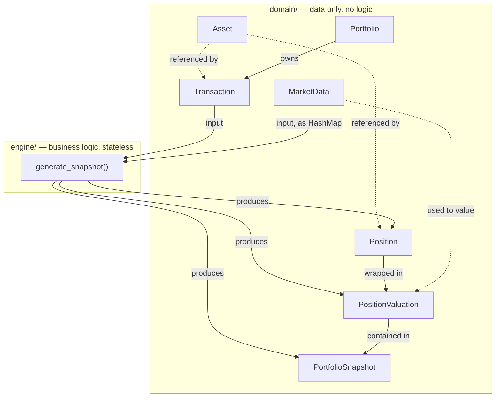

# Domain Model — Improvements & Typed Fields

Companion to `domain.md`. Same entities, with concrete Rust types filled in,
plus flagged gaps and open decisions found while typing things out.

Suggested crates: `rust_decimal` (money), `chrono` (dates/times), `uuid` (ids).

---

## ✅ Design decisions (resolved)

**Same-day transaction ordering.** Use **UUIDv7** for `TransactionId` instead
of plain `Uuid::new_v4()`. UUIDv7 is time-ordered by construction, so sorting
transactions by `(date, id)` is deterministic with no extra field needed —
no separate `sequence` counter to invent or keep in sync.

**Position when quantity hits zero.** Split into two separate concerns
instead of one:
- `Position` represents **current ownership** only. Once `quantity` reaches
  zero, that asset simply has no `Position` in the next `PortfolioSnapshot`
  — nothing to track, because there's no current ownership left.
- **Realized P&L is portfolio-level history, not position-level state.**
  `PortfolioSnapshot.total_realized_pnl` is computed by replaying the
  *entire* transaction history for *all* assets (open or fully closed), so
  fully exiting a position never loses that history — it just stops
  contributing a line to `positions`.
- If a `Position` is currently open, its `realized_pnl` field reflects the
  **cumulative** realized P&L for that asset across all past cycles
  (buy → sell → buy again), not just gains/losses since the position was
  last reopened — this matches wanting full history, not a reset-on-reopen
  view.
- `average_cost` and `cost_basis` **do** reset to zero when quantity hits
  zero — a fresh buy afterward starts a new average-cost cycle. Only
  `realized_pnl` carries forward.

**Non-positive quantity.** Enforced with a smart constructor rather than
left as a doc comment — see `Transaction::new` below.

**Ticker uniqueness.** Treated as a **storage-layer** concern (unique
constraint in SQLite), not enforced by the `Asset` domain type itself.

---

## ⚠️ Open / lower-priority

1. **Missing type: something between `Position` and market data.**
   `Position` explicitly excludes current price / market value / unrealized P&L
   (correct — that's a valuation concern). But `PortfolioSnapshot` claims to
   *contain* `Position` **and** expose `total_market_value` /
   `total_unrealized_pnl`. Nothing in the current model carries **per-asset**
   market value or unrealized P&L — the totals can't be summed without it.
   → Proposed fix below: a `PositionValuation` type that wraps a `Position`
   with the market data used to value it. `PortfolioSnapshot` holds
   `Vec<PositionValuation>`, not `Vec<Position>`.

2. **`MarketData` is referenced constantly but never defined.** `Asset`,
   `Position`, and the Engine all reference it, but there's no fields list
   anywhere in `domain.md`. Given the "Not Responsible For" sections
   elsewhere, this likely lives outside `domain/` (in a `market_data` module)
   — but it should still get a minimal shape now since the Engine depends on
   it as an input type. Sketched below.

3. **`TransactionType` shape doesn't fit its own future variants.** Flagged
   already in conversation — `Dividend`/`Split`/`Interest` don't naturally
   use `quantity` + `price`. Typed both options below so you can pick.

4. **No audit timestamps on `Transaction`.** Since v1 explicitly allows
   editing transactions, there's currently no way to tell *when* an edit
   happened, which matters more than usual since editing a transaction
   silently changes every snapshot derived from it. Consider
   `created_at` / `updated_at`.

5. **`Portfolio.transactions` as `Vec<Transaction>` will need revisiting
   once storage exists.** Fine for the domain model and for v1 in-memory
   use, but once transactions are persisted, loading the *entire* history
   into one `Vec` every time you touch a `Portfolio` may not scale forever.
   Not a v1 problem — just flagging it so it's a deliberate choice later,
   not a surprise.

6. **Currency aggregation isn't addressed.** `Asset.currency` exists, but
   `PortfolioSnapshot` totals (`total_market_value`, etc.) don't state what
   currency they're in. Fine to assume single-currency for v1, but worth
   an explicit assumption in the doc rather than an implicit one.

7. **`serde` feature flags for `Decimal`/`NaiveDate`.** Not urgent — only
   matters once storage/market_data land in Phase 5/6 — but `rust_decimal`
   needs its `serde-with-str` feature enabled to serialize sensibly (avoids
   float round-tripping). Nothing to do yet, just don't forget it.

---

## Where each type is defined

| Type | File |
|---|---|
| `Asset` | `domain/asset.rs` |
| `Transaction`, `TransactionType` | `domain/transaction.rs` |
| `TransactionError` | `domain/errors.rs` (variant of `DomainError`) |
| `Portfolio` | `domain/portfolio.rs` |
| `Position` | `domain/position.rs` |
| `PositionValuation` | `domain/position.rs` — co-located with `Position` since it's a direct wrapper around it, not a separate concern |
| `PortfolioSnapshot` | `domain/snapshot.rs` |
| `MarketData` | `market_data.rs` — **not** under `domain/`, since it belongs to the market data module per the "Not Responsible For" boundaries (see MarketData section below) |
| `AssetId`, `TransactionId`, `PortfolioId` | `ids.rs` |
| `generate_snapshot`, `EngineError` | `engine/portfolio_engine.rs`, `engine/errors.rs` — **renamed from `engine/portfolio.rs`**, since `domain/portfolio.rs` and `engine/portfolio.rs` being identically named made them hard to tell apart with both open — exactly the editor-tab confusion the `domain.rs`+`domain/` module style was meant to avoid in the first place. `PortfolioEngine`/`generate_snapshot` now live in the more explicit `engine/portfolio_engine.rs`. |

---

## Asset
**File:** `domain/asset.rs`


| Field | Type | Notes |
|---|---|---|
| `id` | `AssetId` | newtype over `Uuid` |
| `ticker` | `String` | consider a `Ticker(String)` newtype later if you add validation |
| `name` | `String` | |
| `exchange` | `String` | candidate for an `Exchange` enum once you know the fixed set you'll support |
| `currency` | `Currency` | enum (`Usd`, `Eur`, ...) rather than `String` — prevents typos like `"USD"` vs `"Usd"` vs `"$"` |
| `asset_type` | `AssetType` | enum: `Stock`, `Etf` now; `Option`, `Adr`, `Bond`, `MutualFund`, `Index` later |
| `sector` | `Option<String>` | |
| `industry` | `Option<String>` | |
| `country` | `Option<String>` | |
| *(future)* `isin` | `Option<String>` | |
| *(future)* `cusip` | `Option<String>` | |
| *(future)* `description` | `Option<String>` | |

```rust
pub struct Asset {
    pub id: AssetId,
    pub ticker: String,
    pub name: String,
    pub exchange: String,
    pub currency: Currency,
    pub asset_type: AssetType,
    pub sector: Option<String>,
    pub industry: Option<String>,
    pub country: Option<String>,
}
```

---

## Transaction
**File:** `domain/transaction.rs`

| Field | Type | Notes |
|---|---|---|
| `id` | `TransactionId` | newtype over `Uuid` |
| `asset_id` | `AssetId` | |
| `kind` | `TransactionType` | data-carrying enum — see below (chosen: Option B) |
| `date` | `chrono::NaiveDate` | day/month/year only, no time component — matches manual entry. **Not `String`**: parsing happens once at the CLI input boundary, then every downstream consumer (sorting, FIFO ordering, "transactions this year") gets a real validated date instead of re-parsing/re-validating text every time it's touched |
| `notes` | `Option<String>` | |
| *(future)* `fees` | `Option<Decimal>` | |
| *(future)* `taxes` | `Option<Decimal>` | |
| *(future)* `broker` | `Option<String>` | |
| *(future)* `account` | `Option<String>` | |
| *(future)* `exchange_rate` | `Option<Decimal>` | |
| *(suggested)* `created_at` | `DateTime<Utc>` | audit trail, given transactions are editable |
| *(suggested)* `updated_at` | `Option<DateTime<Utc>>` | `None` until first edit |

**Chosen: data-carrying enum (Option B)** — scales cleanly to Dividend/Split/Interest without those variants carrying meaningless `quantity`/`price` fields they don't use.

```rust
pub struct Transaction {
    pub id: TransactionId,
    pub asset_id: AssetId,
    pub date: NaiveDate, // e.g. NaiveDate::from_ymd_opt(2026, 3, 15)
    pub kind: TransactionType,
    pub notes: Option<String>,
}

pub enum TransactionType {
    Buy { quantity: Decimal, price: Decimal },
    Sell { quantity: Decimal, price: Decimal },
    // later, each variant only carries what it actually needs:
    // Dividend { amount: Decimal },
    // Split { ratio: Decimal },
    // Interest { amount: Decimal },
}

impl Transaction {
    /// Smart constructor — enforces the "quantity always positive" rule
    /// at construction time instead of leaving it as a doc comment.
    pub fn new(
        asset_id: AssetId,
        date: NaiveDate,
        kind: TransactionType,
        notes: Option<String>,
    ) -> Result<Self, TransactionError> {
        if let TransactionType::Buy { quantity, price } | TransactionType::Sell { quantity, price } = &kind {
            if *quantity <= Decimal::ZERO {
                return Err(TransactionError::NonPositiveQuantity);
            }
            if *price <= Decimal::ZERO {
                return Err(TransactionError::NonPositivePrice);
            }
        }
        Ok(Self {
            id: TransactionId::new(), // UUIDv7 — see ids.rs
            asset_id,
            date,
            kind,
            notes,
        })
    }
}
```

<details>
<summary>Option A — flat fields (not chosen, kept for reference)</summary>

```rust
pub struct Transaction {
    pub id: TransactionId,
    pub asset_id: AssetId,
    pub transaction_type: TransactionType,
    pub date: NaiveDate,
    pub quantity: Decimal,
    pub price: Decimal,
    pub notes: Option<String>,
}

pub enum TransactionType {
    Buy,
    Sell,
}
```
</details>

---

## Portfolio
**File:** `domain/portfolio.rs`

| Field | Type | Notes |
|---|---|---|
| `id` | `PortfolioId` | newtype over `Uuid` |
| `name` | `String` | |
| `transactions` | `Vec<Transaction>` | fine for v1 in-memory; revisit once storage/pagination matters (see gap #5) |

```rust
pub struct Portfolio {
    pub id: PortfolioId,
    pub name: String,
    pub transactions: Vec<Transaction>,
}
```

---

## Position
**File:** `domain/position.rs`

| Field | Type | Notes |
|---|---|---|
| `asset_id` | `AssetId` | |
| `quantity` | `Decimal` | |
| `average_cost` | `Decimal` | per-share; resets to `0` whenever `quantity` returns to `0` — a later buy starts a fresh average-cost cycle |
| `cost_basis` | `Decimal` | `average_cost * quantity` — derived, written only by whichever engine function produces the `Position`, not independently settable; also resets with `average_cost` |
| `realized_pnl` | `Decimal` | **cumulative for this asset across all history**, not reset when the position is closed and reopened — this is what preserves P&L history across buy/sell/buy cycles |

**Zero-quantity rule:** a `Position` only exists in `PortfolioSnapshot.positions`
while `quantity > 0`. Fully exiting an asset removes its line from
`positions`, but its contribution to `PortfolioSnapshot.total_realized_pnl`
is never lost — that total is derived from the full transaction history, not
from currently-open `Position`s. See "Design decisions" above.

```rust
pub struct Position {
    pub asset_id: AssetId,
    pub quantity: Decimal,
    pub average_cost: Decimal,
    pub cost_basis: Decimal,
    pub realized_pnl: Decimal,
}
```

---

## PositionValuation *(new — proposed, fills gap #1)*
**File:** `domain/position.rs` — co-located with `Position`

A `Position` combined with the market data used to value it. This is what
`PortfolioSnapshot` should actually hold, not a bare `Position`.

**Where the line actually is between domain and Engine:** not "does this
struct compute anything," but **"could this computation represent a policy
that might vary, or is it a fixed mathematical fact given the inputs?"**

- `Position.cost_basis` genuinely belongs to the Engine — your own doc says
  v1 uses Average Cost Basis but future versions may support FIFO/LIFO
  instead. Same inputs, legitimately different outputs depending on
  algorithm choice. That's policy, and policy is the Engine's job.
- `PositionValuation.market_value` (`quantity * current_price`) and
  `unrealized_pnl` (`market_value - cost_basis`) have no alternate
  algorithm — there's no FIFO-equivalent for multiplication. Given a
  `Position` and a price, there is exactly one correct answer. That's an
  **invariant**, not a decision, so it's safe — arguably safer — to
  guarantee via a constructor on the type itself, so the two fields can
  never be built out of sync no matter how many places in `engine/`
  eventually construct one. The Engine still fully owns *which* `Position`
  and *which* `MarketData` get combined and *when* — that orchestration
  decision stays Engine-side. The constructor only guards the arithmetic
  once those inputs are chosen.

| Field | Type | Notes |
|---|---|---|
| `position` | `Position` | ownership data |
| `current_price` | `Decimal` | price used for this valuation |
| `market_value` | `Decimal` | `position.quantity * current_price` |
| `unrealized_pnl` | `Decimal` | `market_value - position.cost_basis` |

```rust
pub struct PositionValuation {
    pub position: Position,
    pub current_price: Decimal,
    pub market_value: Decimal,
    pub unrealized_pnl: Decimal,
}

impl PositionValuation {
    /// Smart constructor guarding a fixed invariant (not a policy decision —
    /// see note above). The Engine decides which Position/MarketData to
    /// pass in; this just guarantees the derived fields can't drift out of
    /// sync with them.
    pub fn new(position: Position, current_price: Decimal) -> Self {
        let market_value = position.quantity * current_price;
        let unrealized_pnl = market_value - position.cost_basis;
        Self {
            position,
            current_price,
            market_value,
            unrealized_pnl,
        }
    }
}
```

Called from `engine/` like:
```rust
let valuation = PositionValuation::new(position, market_data.price);
```
— the Engine still decides *what* goes in; the struct guarantees the math coming out is always correct.

---

## PortfolioSnapshot
**File:** `domain/snapshot.rs`

| Field | Type | Notes |
|---|---|---|
| `generated_at` | `DateTime<Utc>` | |
| `positions` | `Vec<PositionValuation>` | changed from `Vec<Position>` — see gap #1; only includes assets currently held (`quantity > 0`) |
| `total_cost_basis` | `Decimal` | sum over currently-open `positions` only |
| `total_market_value` | `Decimal` | sum over currently-open `positions` only |
| `total_realized_pnl` | `Decimal` | derived from the **full transaction history**, including fully-closed assets no longer in `positions` — this is where closed-position P&L history lives |
| `total_unrealized_pnl` | `Decimal` | sum over currently-open `positions` only |
| *(future)* `daily_change` | `Decimal` | |
| *(future)* `daily_change_percent` | `Decimal` | |
| *(future)* `total_return` | `Decimal` | |
| *(future)* `total_return_percent` | `Decimal` | |
| *(future)* `asset_allocation` | `HashMap<AssetId, Decimal>` | percentage per asset |
| *(future)* `sector_allocation` | `HashMap<String, Decimal>` | or `HashMap<Sector, Decimal>` once `Sector` is an enum |
| *(future)* `industry_allocation` | `HashMap<String, Decimal>` | |

```rust
pub struct PortfolioSnapshot {
    pub generated_at: DateTime<Utc>,
    pub positions: Vec<PositionValuation>,
    pub total_cost_basis: Decimal,
    pub total_market_value: Decimal,
    pub total_realized_pnl: Decimal,
    pub total_unrealized_pnl: Decimal,
}
```

---

## MarketData *(new — proposed minimal shape, fills gap #2)*
**File:** `market_data.rs` — top-level module, not `domain/`

Not part of `domain/` — this belongs to the `market_data` module per your
existing "Not Responsible For" boundaries. Sketched here only because the
Engine consumes it as an input and it currently has no defined shape at all.

| Field | Type | Notes |
|---|---|---|
| `asset_id` | `AssetId` | |
| `price` | `Decimal` | latest available price |
| `as_of` | `DateTime<Utc>` | when this price was fetched/valid |

```rust
pub struct MarketData {
    pub asset_id: AssetId,
    pub price: Decimal,
    pub as_of: DateTime<Utc>,
}
```

---

## Engine entry point *(new — ties the pieces together)*
**File:** `engine/portfolio_engine.rs` (renamed from `engine/portfolio.rs` — see naming table above)

Formalizes what "Inputs: Transactions, Market Data" / "Outputs: Portfolio
Snapshot" from `domain.md` actually looks like as a signature, resolving a
few relationship questions that were only implicit before.

```rust
pub fn generate_snapshot(
    transactions: &[Transaction],
    market_data: &HashMap<AssetId, MarketData>,
) -> Result<PortfolioSnapshot, EngineError>
```

**Why `&[Transaction]`, not `&Portfolio`:** your own doc states the Engine
"does not require access to the Portfolio object itself, as every
calculation can be derived from the transaction history." Taking a slice
directly (rather than a `Portfolio`) avoids coupling the Engine to a domain
type it doesn't need, and matches that stated independence exactly.

**Why `PortfolioId` doesn't appear anywhere on `Position` /
`PositionValuation` / `PortfolioSnapshot`:** intentional, not forgotten. v1
has exactly one portfolio, so "which portfolio" is just "whichever
transactions were passed in" — not something the Engine's output types need
to track. If multi-portfolio support arrives later, the caller filters
transactions by portfolio *before* calling the Engine; the Engine itself
still wouldn't need to know.

**Why `&HashMap<AssetId, MarketData>`, not a single `MarketData`:**
`MarketData` (the struct) is one price point for one asset. The Engine
needs prices for *every* currently-held asset in a single call, so the
actual input shape is a collection — worth keeping that distinction clear
so "the type" and "what the Engine receives" aren't conflated.

**Missing market data — decide now, not when it happens:** the Processing
Flow says the Engine "obtains the current market value using the provided
Market Data," but doesn't say what happens if a held asset has no entry.
Three options:
- **Fail loud** (`EngineError::MissingMarketData(AssetId)`) — recommended
  for v1: simplest, matches the Engine's deterministic/pure principles,
  and a missing price is a real problem you want surfaced immediately
  rather than silently approximated.
- Skip that position's valuation, keep it in `positions` with
  `market_value`/`unrealized_pnl` omitted or zeroed, exclude from totals.
- Fall back to a cached last-known price — more forgiving, but silently
  stale; probably a v2+ concern once caching exists at all.

---

## Ids (`ids.rs`)

All newtypes over `Uuid` — cheap to write, and they stop `AssetId` and
`TransactionId` from ever being accidentally swapped at a call site.

`TransactionId` uses **UUIDv7** — time-ordered by construction, so sorting
by `(date, id)` gives same-day creation order for free.

`AssetId` uses **UUIDv5**, derived from `(ticker, exchange)` via
`AssetId::for_ticker`. Deterministic, not random: the same ticker always
derives the same id, so nothing needs to persist or look up an
asset-to-id mapping. `Asset::new` calls it internally — the id isn't a
constructor parameter.

Each newtype needs `#[derive(Clone, Copy, PartialEq, Eq, Hash)]` — without
it, these can't be used as `HashMap` keys (`HashMap<AssetId, Position>`) or
compared/sorted, and the compiler won't let you forget it for long, but
worth having upfront rather than discovering it mid-implementation.

```rust
#[derive(Debug, Clone, Copy, PartialEq, Eq, Hash)]
pub struct AssetId(Uuid);

#[derive(Debug, Clone, Copy, PartialEq, Eq, Hash)]
pub struct TransactionId(Uuid);

impl TransactionId {
    pub fn new() -> Self {
        Self(Uuid::now_v7())
    }
}

#[derive(Debug, Clone, Copy, PartialEq, Eq, Hash)]
pub struct PortfolioId(Uuid);
```

---

## Relationship diagram



### Notes on the relationships

- **Only two things ever flow into the Engine: `Transaction`s and
  `MarketData`.** Nothing else — not `Portfolio`, not `Position`, not a
  previous `PortfolioSnapshot`. This is what "stateless" and "deterministic"
  mean in practice: the Engine has no memory between calls, so the same two
  inputs always produce the same output.
- **Everything downstream of the Engine is calculated, not stored.**
  `Position`, `PositionValuation`, and `PortfolioSnapshot` all exist only as
  Engine output — none of them is ever the source of truth, and none of
  them is ever constructed by hand outside `engine/`. Only `Asset` and
  `Transaction` get persisted; everything else is regenerated on demand.
- **`Asset` is the only type with zero outgoing dependencies.** It's
  referenced by `Transaction`, `Position`, and `MarketData`, but references
  nothing itself — it's the one true leaf node, which is exactly right for
  "static descriptive information" per its own purpose statement.
- **Data flows one direction only:** transaction history → Engine →
  snapshot. Nothing downstream (`Position`, `PositionValuation`,
  `PortfolioSnapshot`) ever feeds back into `Transaction` or `Portfolio` —
  there's no cycle in this graph, which is what makes "always regenerable
  from history" actually true rather than aspirational.
- **`Portfolio` itself is a thin owner, not a participant in calculation.**
  It owns `Vec<Transaction>` but is never an Engine input — the Engine only
  ever sees the transaction slice, never the `Portfolio` wrapper around it
  (see "Engine entry point" above). This is why `Portfolio` sits in the
  diagram connected only to `Transaction`, not to the Engine directly.